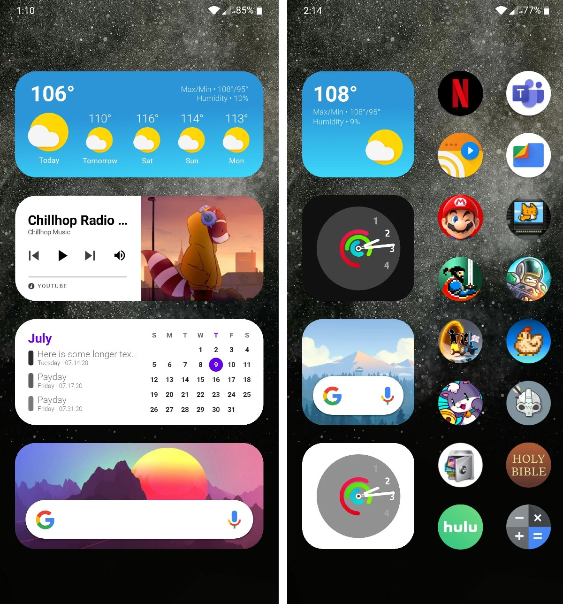
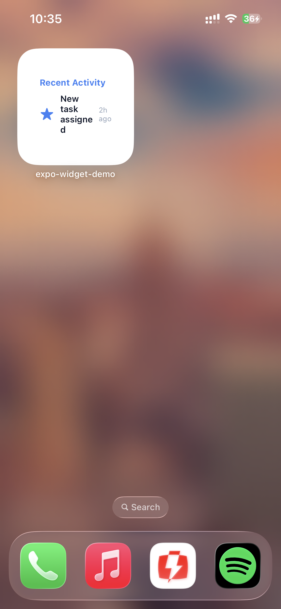
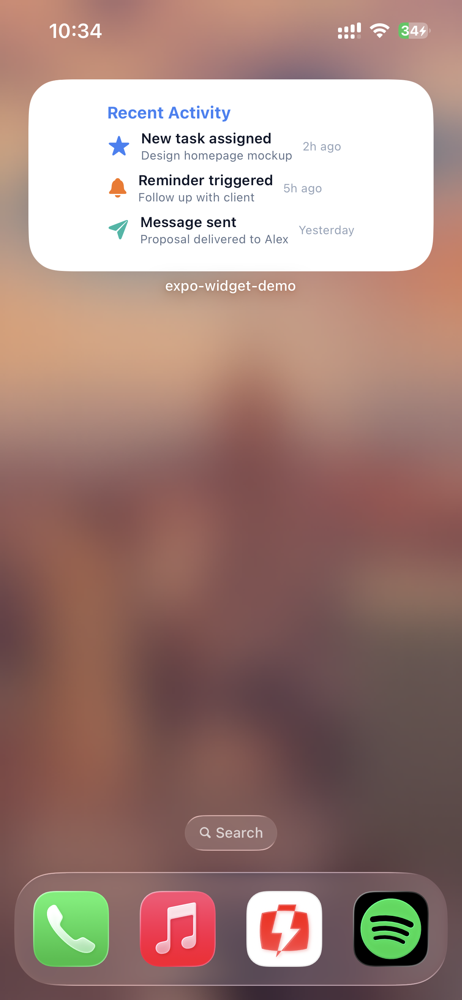
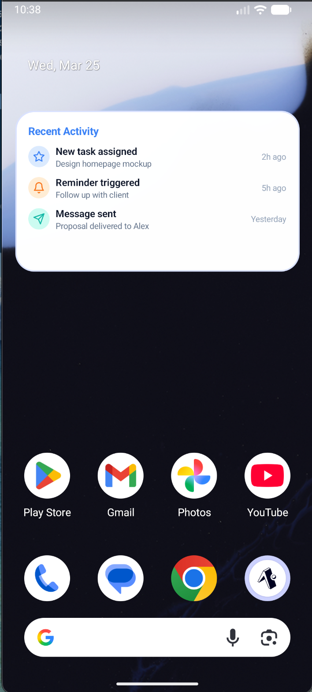
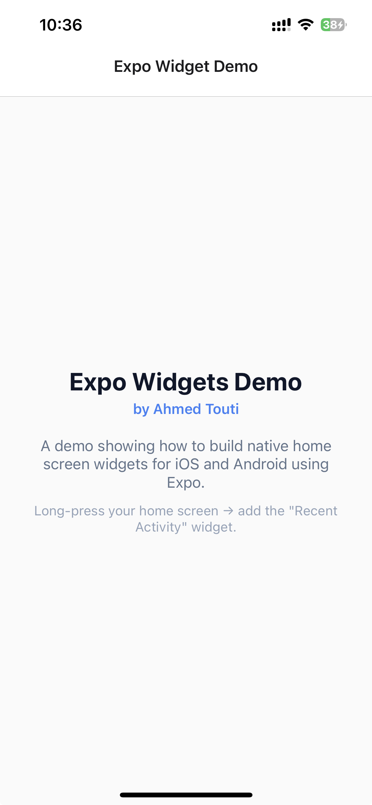
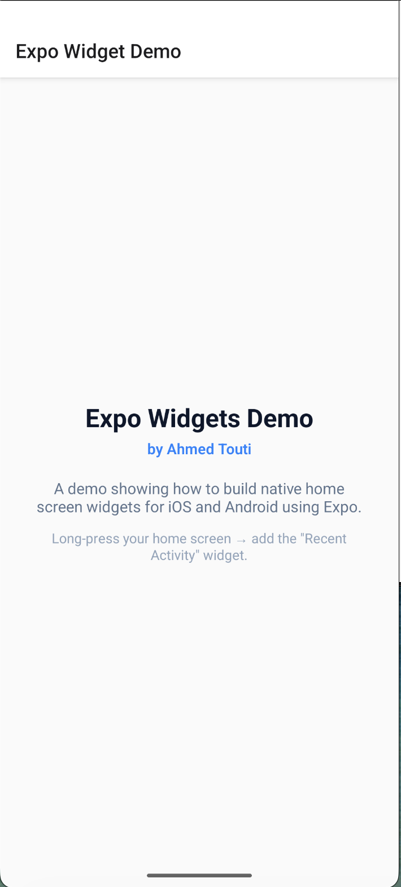

# Expo Widget Demo

A complete working example of **native home screen widgets** for both iOS and Android, built entirely in TypeScript with [Expo](https://expo.dev).

No SwiftUI files. No Kotlin. Just TypeScript.



## Screenshots

| iOS Small Widget | iOS Medium Widget | Android Widget |
|:---:|:---:|:---:|
|  |  |  |

| iOS Home Screen | Android Home Screen |
|:---:|:---:|
|  |  |

## What It Does

A "Recent Activity" widget that:

- Shows up to 3 recent activities with icons, names, subtitles, and timestamps
- **iOS**: Adapts between `systemSmall` (1 row) and `systemMedium` (3 rows) using native SF Symbol icons
- **Android**: Renders Lucide-style SVG icons in colored circle backgrounds via `SvgWidget`
- Deep-links back into the app on tap

## Tech Stack

| Package | Purpose |
|---------|---------|
| [expo](https://expo.dev) | Framework (SDK 55) |
| [expo-widgets](https://docs.expo.dev/versions/latest/sdk/widgets/) | iOS widget — compiles JSX to SwiftUI |
| [react-native-android-widget](https://github.com/nicbock/react-native-android-widget) | Android widget — renders React Native to RemoteViews |
| [sf-symbols-typescript](https://github.com/nicbock/sf-symbols-typescript) | TypeScript types for SF Symbol names |

## Project Structure

```
src/
├── app/
│   ├── _layout.tsx                        # Root layout — registers iOS widget
│   └── index.tsx                          # Home screen
└── widgets/
    ├── mock-data.ts                       # Shared types + sample data
    ├── recent-activity-widget.tsx          # iOS widget (compiles to SwiftUI)
    ├── recent-activity-widget.android.tsx  # Android widget (React Native)
    ├── register-widgets.ts                # iOS bootstrap — pushes data to widget
    ├── widget-task-handler.ts             # Android lifecycle handler
    └── use-widget-sync.ts                 # Hook to sync data on mount
index.js                                   # Entry point — registers Android handler early
```

## Getting Started

### Prerequisites

- Node.js 18+
- Xcode 15+ (for iOS)
- Android Studio (for Android)
- A physical device or simulator (**widgets don't work in Expo Go**)

### Install

```bash
git clone https://github.com/AhmedTouti/expo-widget-demo.git
cd expo-widget-demo
npm install
```

### Run on iOS

```bash
npx expo prebuild --clean --platform ios
npx expo run:ios
```

Then long-press the home screen → tap **+** → search for **Expo Widget Demo** → add the widget. Try both Small and Medium sizes.

### Run on Android

```bash
npx expo prebuild --clean --platform android
npx expo run:android
```

Then long-press the home screen → tap **Widgets** → find **Expo Widget Demo** → drag the widget onto the home screen.

## How It Works

### iOS — expo-widgets

The iOS widget is a single function with a `'widget'` directive that gets compiled to native SwiftUI at build time:

```tsx
function RecentActivityWidget(props: WidgetProps, env: WidgetEnvironment) {
  'widget';
  const isSmall = env.widgetFamily === 'systemSmall';
  // ...SwiftUI primitives from @expo/ui/swift-ui
}
```

**Key constraints:**
- No `.map()` — SwiftUI widgets are static, so data is passed as flat numbered props (`name1`, `name2`, `name3`)
- No sub-components — everything must be inlined in the main function
- Icons use SF Symbols via `<Image systemName="star.fill" />`

### Android — react-native-android-widget

The Android widget uses familiar React Native patterns with special widget primitives:

```tsx
function RecentActivityWidget({ activities }: Props) {
  return (
    <FlexWidget>
      {activities.map(a => <ActivityRow key={a.id} activity={a} />)}
    </FlexWidget>
  );
}
```

**Key differences from iOS:**
- `.map()`, extracted components, and full objects all work
- Icons use `SvgWidget` with raw SVG strings (Lucide icon paths)
- SVG templates use a `"STROKE"` placeholder replaced with the activity's color at render time

### Android Task Handler Timing

The widget task handler **must** be registered before React mounts. This project uses a custom `index.js` entry point:

```js
// index.js
import { registerAndroidWidgetTaskHandler } from './src/widgets/widget-task-handler';
registerAndroidWidgetTaskHandler();
import 'expo-router/entry';
```

If you register it too late, you'll get: `No task registered for key RNWidgetBackgroundTask`.

## Gotchas

1. **No Expo Go** — widgets require native code that Expo Go doesn't include. Use a development build.
2. **iOS sub-components break** — the expo-widgets compiler can't handle extracted function components. Inline everything.
3. **Flat props on iOS** — no dynamic lists in SwiftUI widgets. Use `name1`, `name2`, `name3` style props.
4. **SF Symbol type casting** — `systemName` expects the `SFSymbol` union type. Cast strings with `as SFSymbol`.
5. **Android `backgroundColor` type** — expects `` `#${string}` `` template literal, not plain `string`.
6. **Android handler timing** — register the widget task handler in `index.js` before `expo-router/entry`.

## Customizing

To use this with real data:

1. Replace `WIDGET_ACTIVITIES` in `mock-data.ts` with your own data source
2. Call `syncWidget()` (from `useWidgetSync`) after fetching new data
3. Add new SF Symbol / SVG icon pairs to the icon maps
4. Adjust `updatePeriodMillis` in `app.json` for background refresh frequency

## License

[MIT](./LICENSE) — Ahmed Touti
